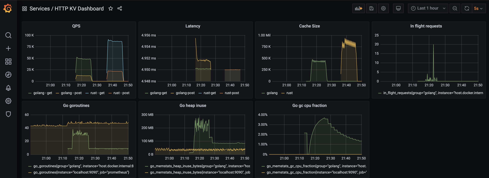

# http-kv

Some http server example that can store key value

## Golang implementation

See [golang](./golang) folder for details to see how to start the backend server, and how to do some simple load testing (GET/POST in 80/20 ratio)

## Prometheus and Grafana

See the [prometheus](./prometheus) folder for details to see how to start Prometheus and Grafana to monitor the server metrics

A graph during some performance testing
